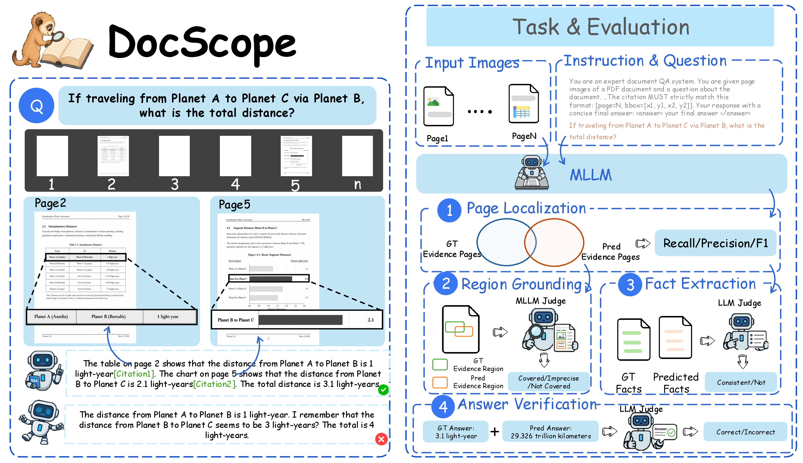

<h1 align="center">
DocScope: Benchmarking Verifiable Reasoning for 
Trustworthy Long-Document Understanding
</h1>

  <strong><em>Xiang Feng</em></strong>1,
  <strong><em>Jiawei Zhou</em></strong>1,
  <strong><em>Zhangfeng Huang</em></strong>2,
  <strong><em>Kewei Wang</em></strong>3 
  <strong><em>Shanshan Ye</em></strong>4,
  <strong><em>Jinxin Hu</em></strong>2,
  <strong><em>Zulong Chen</em></strong>2,&dagger;,
  <strong><em>Yong Luo</em></strong>1,&dagger;,
  <strong><em>Jing Zhang</em></strong>1,&dagger;,&Dagger;

  <strong>1 School of Computer Science, National Engineering Research Center for Multimedia Software</strong> 
  <strong>and Hubei Key Laboratory of Multimedia and Network Communication Engineering,</strong> 
  <strong>Wuhan University, China</strong> 
  <strong>2 Alibaba Group, Hangzhou, China</strong> 
  <strong>3 Department of Electronic Engineering and Information Science,</strong> 
  <strong>University of Science and Technology of China, China</strong> 
  <strong>4 AAII, School of Computer Science, University of Technology Sydney, Australia</strong>

  <strong>&dagger; Corresponding author, &Dagger; Project leader</strong>

  

  <strong>Figure 1.</strong> Overview of DocScope.

